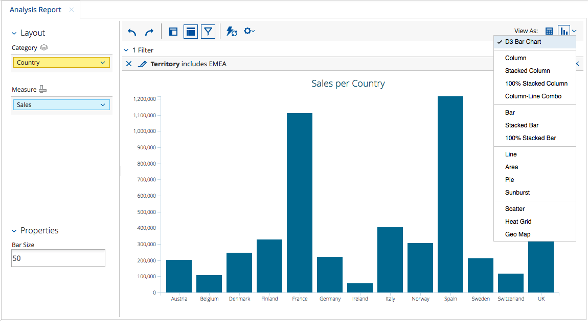
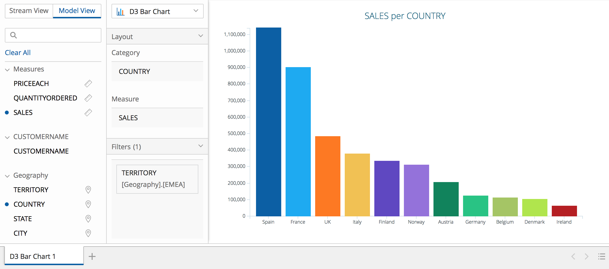

# Overview



The [Visualization API]({{site.refDocsUrlPattern | replace: '$', 'pentaho.visual'}}) 
provides a unified way to visualize data across the Pentaho suite 
(e.g.
[Analyzer](http://www.pentaho.com/product/business-visualization-analytics), 
[PDI](http://www.pentaho.com/product/data-integration), 
[CDF](http://community.pentaho.com/ctools/cdf/)).

Essentially, it is a set of abstractions that enables safe, isolated operation between 
applications, visualizations and business logic.

A **visualization** is constituted by:

- One [`Model`]({{site.refDocsUrlPattern | replace: '$', 'pentaho.visual.base.Model'}}), 
  which _identifies_ the visualization and 
  _defines_ it in terms of its their data requirements, 
  such as the visual degrees of freedom it has (e.g. _X position_, _color_ and _size_) and 
  any major options that affect its rendering.

- One [`View`]({{site.refDocsUrlPattern | replace: '$', 'pentaho.visual.base.View'}}) (at least), 
  which implements the actual rendering using chosen technologies 
  (e.g. [HTML](https://www.w3.org/TR/html/), [SVG](https://www.w3.org/TR/SVG/), [D3](https://d3js.org/)),
  and handle user interaction, 
  dispatching [actions]({{site.refDocsUrlPattern | replace: '$', 'pentaho.visual.action'}}) and, 
  for example, showing tooltips.

The Visualization API is built on top of other Platform JavaScript APIs:

- The [Data API]({{site.refDocsUrlPattern | replace: '$', 'pentaho.data'}}) 
  ensures seamless integration with data sources in the Pentaho platform, 
  as well as with other client-side component frameworks.

- The [Type API]({{site.refDocsUrlPattern | replace: '$', 'pentaho.type'}}) 
  provides to visualizations out-of-the-box features such as class inheritance, metadata support, configuration, 
  validation and serialization.

- The [Core APIs](../../#core) provide to visualizations features such as localization, theming and 
  services registration and consumption.

A set of stock visualizations is included, covering the most common chart types.
Based on the [CCC](http://community.pentaho.com/ctools/ccc/) charting library, 
they're customizable and extensible to fit your organization's desired look and feel.

If you want to know more about the specifics of how Analyzer exposes the Visualization API, 
read [Analyzer and the Visualization API](analyzer-viz-api).

The following sections will guide you through the complete process of creating a custom visualization 
for the Pentaho platform, from developing the visualization itself to deploying it to Pentaho products.
 
1. [Create a visualization](#create-a-visualization)
   1. [Develop the visualization itself](#develop-the-visualization-itself)
   2. [Create the Pentaho Web Package](#create-the-pentaho-web-package)
   3. [Create the OSGi Web Project](#create-the-osgi-web-project)
2. [Build the OSGi Web Project](#build-the-osgi-web-project)
3. [Deploy the OSGi Artifact](#deploy-the-osgi-artifact)
4. [Configure the visualization](#configure-the-visualization)

# Create a visualization

## Fast-lane

If you prefer to skip through the development of the visualization itself, 
up until its bundling as an OSGi artifact,
you can skip the following sub-sections and head on to 
[Build the OSGi Web Project](#build-the-osgi-web-project).
Before you go, though, you should clone the complete OSGi project:

```shell
# Clone the repository.
git clone https://github.com/pentaho/pentaho-engineering-samples

# Go to the sample's directory.
cd Samples_for_Extending_Pentaho/javascript-apis/platform/pentaho/visual/samples/bar-d3-bundle
```

## Develop the visualization itself

Read the [Bar/D3 sample](samples/bar-d3-sandbox) walk-through, 
which guides you through the development of a custom visualization having a [D3](https://d3js.org/)-based view,
under a controlled sandbox environment.

## Create the Pentaho Web Package

In the previous section you developed a custom visualization and tested it in a controlled sandbox environment.
To use the visualization _anywhere_ in the Pentaho platform, 
it must take the form of a [Pentaho Web Package](../web-package). 
This essentially means that you need to create a `package.json` file that describes the contained resources.

Apart from the mandatory `name` and `version` fields, and the D3 library dependency, 
you must also advertise the existence of your visualization to the platform, 
so that applications like Analyzer and PDI can offer it to users.
This is done by registering 
the visualization's [`Model`]({{site.refDocsUrlPattern | replace: '$', 'pentaho.visual.base.Model'}}) module
with [`pentaho/service`]({{site.refDocsUrlPattern | replace: '$', 'pentaho.service'}}),
as a service of type `pentaho/visual/base`.

The default configuration module that you developed also needs to be advertised to the configuration system,
by registering it with `pentaho/service` as a service of type `pentaho.config.spec.IRuleSet`.

The result is the following `package.json` content:

```json
{ 
  "name": "pentaho/visual/samples/bar",
  "version": "1.0.0",
  
  "config": {
    "pentaho/service": {
      "pentaho/visual/samples/bar_1.0.0/model": "pentaho/visual/base",
      "pentaho/visual/samples/bar_1.0.0/config": "pentaho.config.spec.IRuleSet"
    }
  },
  
  "dependencies": {
    "d3": "^4.8.0"
  }
}
```

## Create the OSGi Web Project

The Pentaho platform is built on top of an OSGi container, 
so developers must provide their code as an OSGi/Karaf artifact. 
Additionally, any client-side dependencies must also be provided to the platform as OSGi bundles.

The recommended way is to put the visualization bundle, its dependencies, 
and corresponding feature definition together into a single KAR file.

See [Create an OSGi Web Project for a Web Package and its Dependencies](../osgi-web-project) for instructions.

# Build the OSGi Web Project

Now that you have an OSGi project containing the custom Bar/D3 visualization, 
you need to build it. At the project root execute:

```shell
mvn clean package
```

If everything went well, the KAR artifact will be located at `assemblies/target`.

# Deploy the OSGi Artifact

See [OSGi Artifacts Deployment](../osgi-deployment) for quick instructions on 
how to deploy the KAR file you just built.

If everything went well, you should now see your visualization being offered in Analyzer and/or PDI:

1. Your Bar/D3 visualization in Analyzer:
   
   

2. Your Bar/D3 visualization in the PDI menu:
   
   
   
3. Your Bar/D3 visualization in PDI:
   
   

<!-- TODO: Explain how to distribute it using marketplace? -->

# Configure the visualization

Besides the default configuration you have included with the visualization,
the visualization can be further configured by third-parties. 

See [Configuring a Visualization](configuration) for more details.
