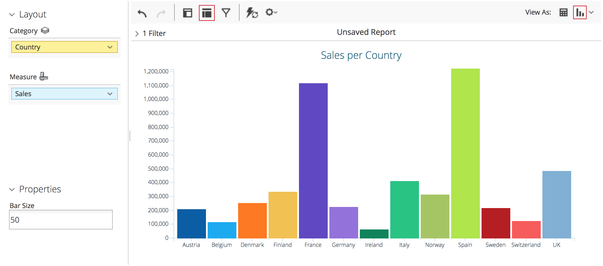

# Overview

As of 7.1, the Pentaho platform ships with a _new_ version of the Visualization API, still in **beta**, 
**side-by-side** with the _previous_ version. This documentation relates to the new version.

The Pentaho Visualization API provides a unified way to visualize data across the Pentaho suite 
(e.g.
[Analyzer](http://www.pentaho.com/product/business-visualization-analytics), 
[PDI](http://www.pentaho.com/product/data-integration), 
[CDF](http://community.pentaho.com/ctools/cdf/)).

Essentially, it is a set of abstractions that ensures isolation between
applications, visualizations and configurations (that glue the two together).

Visualizations are implemented on top of the Pentaho Core, Type and Data JavaScript APIs:
- Using the [Type API]({{site.refDocsUrlPattern | replace: '$', 'pentaho.type'}}) 
  endows visualizations with out-of-the-box class inheritance, metadata support, type configuration, 
  validation, serialization, among other features.
- Using the [Data API]({{site.refDocsUrlPattern | replace: '$', 'pentaho.data'}}) 
  ensures seamless integration with data sources in the Pentaho platform, 
  as well as with other client-side component frameworks.
- Using [Core APIs]()
  provides visualizations with features such as localization, theming and registration.

The platform provides a set of stock visualizations, covering the most
common chart-types.
Based on the [CCC](http://community.pentaho.com/ctools/ccc/) charting
library, they're customizable and extensible to fit your organization's
desired look and feel.
For more information on how to customize visualizations,
see [Configuration](configuration).

If you want to know more about how Pentaho Analyzer exposes the new Visualization API, 
read [Analyzer and the Visualization API](analyzer-viz-api).

# Creating a visualization

Visualizations are constituted by one [`Model`]({{site.refDocsUrlPattern | replace: '$', 'pentaho.visual.base.Model'}}) 
and (at least) one [`View`]({{site.refDocsUrlPattern | replace: '$', 'pentaho.visual.base.View'}}).
Models identify visualizations and 
define their data requirements. Views implement the actual rendering using chosen technologies 
(e.g. [HTML](https://www.w3.org/TR/html/), [SVG](https://www.w3.org/TR/SVG/), [D3](https://d3js.org/)),
and handle user interaction, 
dispatching [actions]({{site.refDocsUrlPattern | replace: '$', 'pentaho.visual.action'}}) and, 
for example, showing tooltips.

For a better understanding, see the [Bar/D3 sample](samples/bar-d3-sandbox),
that walks you through creating a custom visualization having a
[D3](https://d3js.org/)-based view.

# Packaging

Your visualization must be wrapped as a Pentaho Web Package. 
All packages must contain a file `META-INF/js/package.json`, 
holding the relevant metadata about the resources being deployed.

Apart from the mandatory `"name"` and `"version"` fields, you must also register your visualization into the platform. This is done by configuring the `pentaho/service` plugin to declare your visualization's model class as implementing/extending `"pentaho/visual/base"`.

If you provide any configuration file you must as well declare it as implementing `"pentaho.config.spec.IRuleSet"`.

Finally, any third-party dependencies must be declared in the same file.

```json
{ 
  "name": "foo",
  "version": "1.0.0",
  "config": {
    "pentaho/service": {
      "foo_1.0.0/my-viz/model": "pentaho/visual/base",
      "foo_1.0.0/my-viz/config": "pentaho.config.spec.IRuleSet"
    }
  },
  "dependencies": {
    "bar": "~2.0"
  }
}
```

See [Pentaho Web Package description](../pentaho-web-package) for a more detailed view.

# Bundling and provisioning

The Pentaho platform is built on top of an OSGi container, so developers must provide their code as an OSGi bundle. 
Additionally, the required client side dependencies must also be provided to the platform as bundles.

The recommended way is to put the visualization bundle, its dependencies, 
and corresponding feature definition together into a single KAR file.

See [Bundling](bundling) for instructions.

# Deploying the visualization

The platform supports hot deployment: simply drop a bundle file in the deploy directory and 
Apache Karaf will detect the file and try to deploy it.

For PDI the Karaf folder is located in `system/karaf`. 
On the Pentaho Server it's found within `pentaho-solutions/system/karaf`.

You can drop any KAR file, bundle or Feature file into the `karaf/deploy` folder. 
It will be automatically installed and activated, even after restarts of the product. 
Replacing a bundle or feature already in the deploy folder will reinstall it within OSGI. Deleting it will uninstall.

If every thing went well you should now see your visualization in Analyzer and/or PDI.

<br>
*Your Bar/D3 walkthrough visualization in Analyzer*


<br>
*Your Bar/D3 walkthrough visualization in PDI*

> TODO: Explain how to distribute it using marketplace?

# Configuring a visualization

Pentaho's JavaScript API allows users to declare _prioritized configuration rules_ 
that configure the objects built using the Type API.

Typical configuration rules include:
- modifying default values for properties,
- adding validations, 
- extending objects with environment-specific properties

See [configuration](configuration) for more details.

