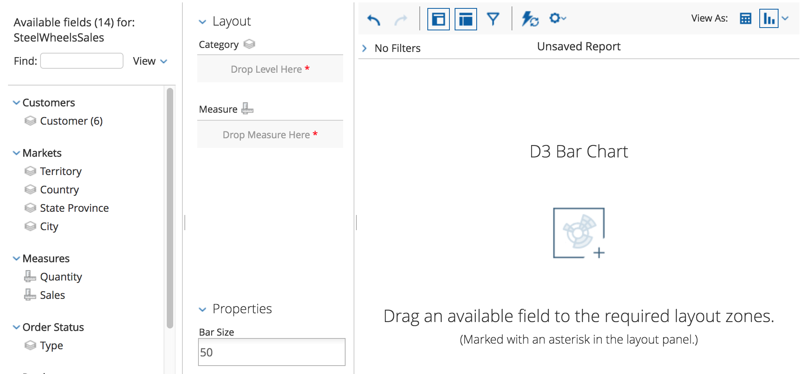
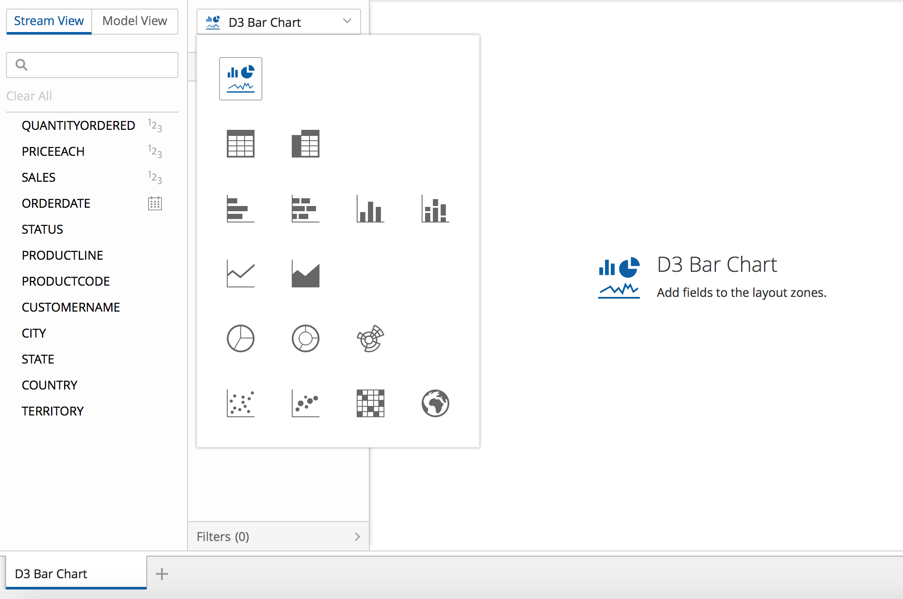

As soon as you see your visualization showing up in
[Analyzer](http://www.pentaho.com/product/business-visualization-analytics) or in 
[PDI](http://www.pentaho.com/product/data-integration),
you'll notice that it is displayed with a "generic visualization" icon:

1. In **Analyzer**, 
   the canvas will display a placeholder image, of a sunburst visualization
   (yes, that's the current "generic" image...):
   
   

2. In **PDI**, each tab has a visualization menu which displays a button icon, 
   a larger two-states icon in the menu's drop-down, and 
   a placeholder image displayed in the canvas, 
   and all of these display a generic visualization image:

    

Currently, there is no standard, for visualization container applications, on the various pieces of styled content
that a visualization should provide to better integrate with it. 
Styling at this level must be done for each container. 

You will learn to provide custom icons for all of the described scenarios.
A single CSS stylesheet will be created and loaded with the visualization model file.
 
## Creating the CSS file

In the `css` folder, create a file named `model.css`. Add the following content to it:

```css
/* -- Analyzer -- */

/* Canvas placeholder image */
.pentaho-visual-samples-bar.component-icon-landscape {
  background-image: url("./images/analyzer-bar-d3-placeholder.png");
}

/* -- PDI -- */

/* Viz Type Selector - Selected Viz Button */
.pentaho-visual-samples-bar.visualization-switcher-button-icon {
  background-image: url("./images/pdi-bar-d3-button.svg");
}

/* Viz Type Selector - Drop-down icons */
.visualization-selector .pentaho-visual-samples-bar.component-icon-sprite {
  background-image: url("./images/pdi-bar-d3-sprite.svg");
}

/* Canvas placeholder image */
.pentaho-visual-samples-bar .canvas.message .icon {
  background-image: url("images/pdi-bar-d3-placeholder.svg");
}
```

Remarks:
  - The CSS rules are scoped with the visualization model's
    CSS [style class]({{site.refDocsUrlPattern | replace: '$', 'pentaho.type.Type' | append: '#styleClass'}}), 
    just like was the case when styling the view.

Copy the images provided in 
[pentaho/pentaho-engineering-samples]({{site.platformSamplesBaseUrl | append: "javascript-apis/platform/visual-samples-bar-d3/css/images"}})
into an `images` folder, inside of the `css` folder.

## Loading the CSS file with the model

To load the model's CSS file dynamically, whenever the model module is loaded, use the `css` AMD/RequireJS plugin.
Modify the AMD module declaration of the `model.js` file to the following:

```js
define([
  "module",
  "css!./css/model"
], function(module) {
  // ...
});
```

That's it. You'll only be able to test this later, 
when deploying the visualization to the Pentaho Server and to PDI. 

**Continue** to [Adding interactivity to the view](step6-view-interactivity).
