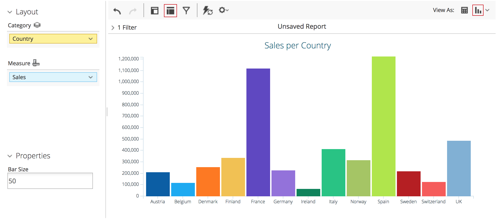
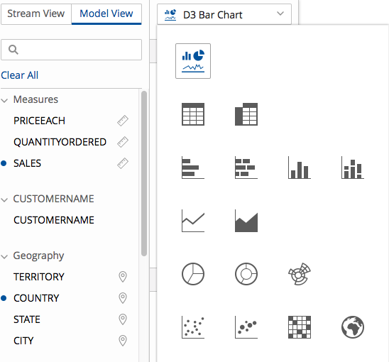
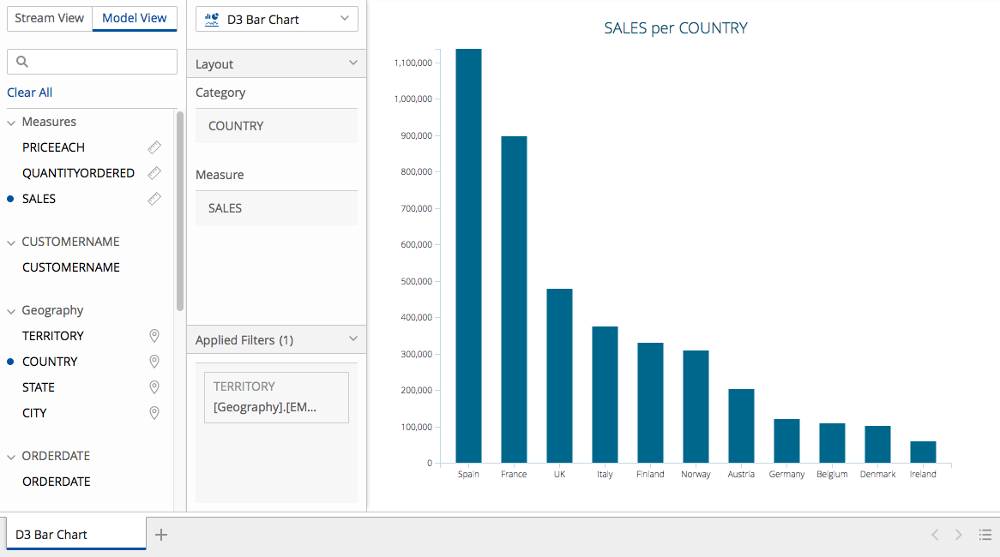
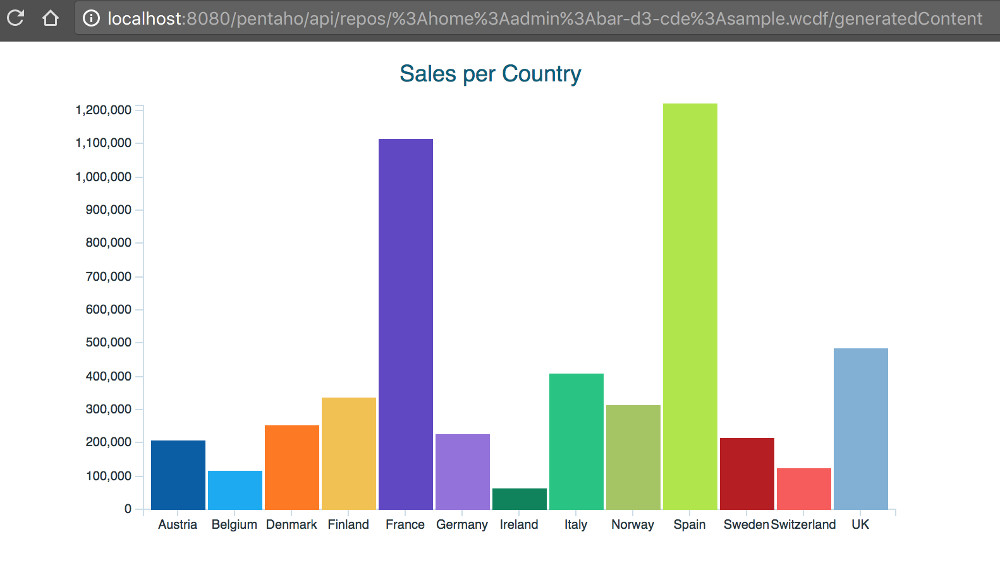

# Overview



The [Visualization API]({{site.refDocsUrlPattern | replace: '$', 'pentaho.visual'}}) 
provides a unified way to visualize data across the Pentaho suite 
(e.g.
[Analyzer](http://www.pentaho.com/product/business-visualization-analytics), 
[PDI](http://www.pentaho.com/product/data-integration), 
[CDF](http://community.pentaho.com/ctools/cdf/)).

Essentially, it is a set of abstractions that enables safe, isolated operation between 
applications, visualizations and business logic.

The Visualization API is built on top of other Platform JavaScript APIs:

- The [Data API]({{site.refDocsUrlPattern | replace: '$', 'pentaho.data'}}) 
  ensures seamless integration with data sources in the Pentaho platform, 
  as well as with other client-side component frameworks.

- The [Type API]({{site.refDocsUrlPattern | replace: '$', 'pentaho.type'}}) 
  provides to visualizations out-of-the-box features such as class inheritance, metadata support, configuration, 
  validation and serialization.

- The [Core APIs](../../#core) provide to visualizations features such as localization, theming and 
  services registration and consumption.

A set of stock visualizations is included, covering the most common chart types.
Based on the [CCC](http://community.pentaho.com/ctools/ccc/) charting library, 
they're customizable and extensible to fit your organization's desired look and feel.

If you want to know more about the specifics of how Analyzer exposes the Visualization API, 
read [Analyzer and the Visualization API](analyzer-viz-api).

The following sections will guide you through the complete process of creating a custom visualization 
for the Pentaho platform, 
from [developing it](#creating-a-visualization), 
to [deploying it](#deploying-the-visualization) to Pentaho products and 
to [configuring it](#configuring-the-visualization).
 
# Creating a visualization

Creating a visualization boils down to creating:

- One [`Model`]({{site.refDocsUrlPattern | replace: '$', 'pentaho.visual.base.Model'}}) — 
  which _identifies_ the visualization and 
  _defines_ it in terms of its data requirements, 
  such as the visual degrees of freedom it has (e.g. _X position_, _color_ and _size_) and 
  any major options that affect its rendering, — and

- One [`View`]({{site.refDocsUrlPattern | replace: '$', 'pentaho.visual.base.View'}}) (at least) — 
  which implements the actual rendering using chosen technologies 
  (e.g. [HTML](https://www.w3.org/TR/html/), [SVG](https://www.w3.org/TR/SVG/), [D3](https://d3js.org/)),
  and handle user interaction, 
  dispatching [actions]({{site.refDocsUrlPattern | replace: '$', 'pentaho.visual.action'}}) and, 
  for example, showing tooltips.

The [Create a Custom Visualization](create) walk-through shows you how to develop these and 
how to create an OSGi artifact containing the visualization, 
so that it can be deployed to a Pentaho product.

{% include callout.html content="<h2>Fast-lane</h2>

If you prefer, you can skip the walk-through and get the final Pentaho Web Project, and build it. First make sure that you have git and maven 3+ installed and that this <a href='https://github.com/pentaho/maven-parent-poms/blob/master/maven-support-files/settings.xml'>settings.xml</a> is in your USER_HOME/.m2 directory.

<pre class='highlight'><code># Clone the repository.
git clone https://github.com/pentaho/pentaho-engineering-samples

# Go to the sample's directory.
cd pentaho-engineering-samples
cd Samples_for_Extending_Pentaho/javascript-apis/platform/pentaho/visual/samples/bar-d3-bundle

# Build the Web Project
mvn package
</code></pre>" type="warning" %}

# Deploying the visualization

To deploy the visualization to a Pentaho product (Pentaho Server or PDI), 
copy the KAR file you just built (located at `assemblies/target`) into its `system/karaf/deploy` folder.
See [OSGi Artifacts Deployment](../osgi-deployment) if you need more information.

If everything went well, you should now see your visualization being offered in Analyzer and PDI, 
as well as be able to use it in a [CDE](http://community.pentaho.com/ctools/cde/) dashboard:

1. Your Bar/D3 visualization in Analyzer:
   
   

2. Your Bar/D3 visualization in the PDI menu:
   
   
   
3. Your Bar/D3 visualization in PDI:
   
   

4. Your Bar/D3 visualization in CDE:
   
   You can get the following dashboard from the
   `https://github.com/pentaho/pentaho-engineering-samples` repository,
   at the location:
   `Samples_for_Extending_Pentaho/javascript-apis/platform/pentaho/visual/samples/bar-d3-cde`.
   
   

<!-- TODO: Explain how to distribute it using marketplace? -->

# Configuring the visualization

A visualization can be configured by third-parties using configuration rules in external configuration files.
These configurations are merged with any default configuration that is included with the visualization.

See [Configuring a Visualization](configuration) for more details.
